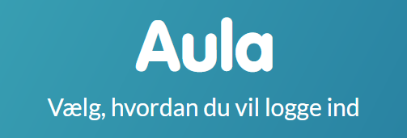

# AulaAPIClient

A wrapper around the Aula school portal, written in typescript. Written against the Danish version (Aula.dk).
En wrapper omkring Aula skoleportalen, skrevet i TypeScript. Skrevet til den danske version (Aula.dk).

The code itself is non-Danish specific, but if there are other non-Danish Aula versions, the login flow or APIs might be different.

Key features:
- Pull all major data elements, including:
    - Daily Overview
    - Threads and messages (within timeframe)
    - Posts (within timeframe)
    - Get attachments (images, files) on posts, messages, etc
    - Lookup of parents, children, teachers, etc
    - Pull latest galleries (photos, etc)
- Pulls almost 1:1 all data from Aula, allowing for your own filtering of important information
- Does not write to Aula, send messages or similar

See the sample [integration tests](/tests/defaultIntegration.test.ts) for a fuller example of the various methods and usage.

Note: The Aula API is currently on version 22 at the time of this writing and this client is written for that version.  If Aula updates (v23+), it is possible the methods will still work, but the data structures may change. Meaning, it probably would still work fine, but potentially could introduce errors if the data objects change.




## Login

In August 2025, the Danish IT strategy changed Unilogin so only students can use it, not parents.  This means that parents must log into Aula using their MitID credentials, and because of this, the previous username/password route offered by Unilogin is no longer a viable way to access Aula for parents.
https://viden.stil.dk/spaces/OFFSKOLELOGIN/pages/104333383/Roadmap%2Bfor%2BUnilogin

However, when normally logging into Aula in your browser, you are exchanging MitID credentials for a cookie value that is sent to Aula on every subsequent API request. That cookie value is:
PHPSESSID=abcdefghijklmop...  and you can see this cookie in your browser development tools for /api requests on Aula. In other words, as long as you have a valid PHPSESSID cookie value (acquired through a MitID signin), this can run autonomously from that point forward.

The use of this library allows you to inject a function as part of the config that retrieves the value of a valid PHPSESSID cookie. That cookie value can be obtained by visiting Aula in your browser, then using the development tools to examine the request cookies on /api calls.  

This cookie value (session) requires that you manage its validity outside this library.  At the last round of testing, (a) this session value is valid even after being idle for 6+ hours, and (b) the session value appears to be valid for more than 24 hours after creation.  

The upshot is that you should be able to: (a) login with MidID in your browser once, (b) retrieve the PHPSESSID cookie value using your dev tools, (c) persist/save that cookie to a safe and stateful location of your choice (environment, database, etc), (d) separately have an external automatic ping process that keeps the session "alive" and then (e) when using *this* library, pass a function (ISessionIDProvider.getKnownSessionId()) that retrieves the value from wherever you kept it.  

Because you must still authenticate with MitId in order to get this session ID value, this is not circumventing any security concerns.  This is essentially the same as logging on with MitID, and then keeping your browser open and refreshing it periodically.  A separate project may be introduced which simplifies the keep-alive session management, since that is not just a library to access Aula, but a running process.

### Example code

Here is an example of logging in, getting the last 21 days of Posts, and then getting an image attachment off the first post.

````javascript

    const aulaConfig = new AulaClientConfig();

   let sessionProvider : ISessionIdProvider = {
        getKnownAulaSessionId: async function (): Promise<string> {
            //GET THE SESSION ID FROM SOMEWHERE YOU ARE KEEPING IT ALIVE.  If the sessionID is expired on the aula side, this will fail
        }
    }
    aulaConfig.sessionIdProvider = sessionProvider;
    
    let aulaClient = new AulaAPIClient(aulaConfig);

    await aulaClient.Login();

    //Get the last 21 days of Posts
    let POSTS_RETRIEVE_PAST_DAYS = 21;
    let posts = await aulaClient.GetPosts(POSTS_RETRIEVE_PAST_DAYS);

    //Get the url of the image attachment for download.  Note: these urls have an expiration, so must be used quickly.
    let firstPost = posts[0];
    if (firstPost.HasImageAttachments()) {
        let imageAttachments = firstPost.GetImageAttachments();
        let urlToImage = imageAttachments[0].GetFullSizeUrl();
        //... Download the image.  URL is an S3 signed URL, so has a built-in time expiration
    }

````
### Aula Client and Methods

There is a sample integration test using Jest: [integration tests](/tests/defaultIntegration.test.ts) which demonstrates various possibilities and can be used as a reference.

When logging into Aula, you may have multiple profiles, multiple children, and multiple institutions (schools, etc).  Aula -and therefore this client- only acts in the context of a given profile/child/institution combination.  So, for example, if you have multiple children, you must switch the active child in the client.  There is no native "all children" or "all institutions" behavior in this client.

````javascript

    const aulaConfig = new AulaClientConfig();

   let sessionProvider : ISessionIdProvider = {
        getKnownAulaSessionId: async function (): Promise<string> {
            //GET THE SESSION ID FROM SOMEWHERE YOU ARE KEEPING IT ALIVE.  If the sessionID is expired on the aula side, this will fail
        }
    }
    aulaConfig.sessionIdProvider = sessionProvider;
    
    let aulaClient = new AulaAPIClient(aulaConfig);

    await aulaClient.Login();

    //The first/default child will be set automatically at login
    let currentChild = aulaClient.CurrentChild; //Assume this is "Johnny"

    //This will get the calendar events for the currently set child, Johnny
    let events = aulaClient.GetCalendarEvents();

    //Find my other child named Billy
    let allMyChildren = aulaClient.GetMyChildren();
    let foundChild = allMyChildren.filter(child => child.name.indexOf("Billy") > -1)[0];

    //Set the context of the client to Billy
    let foundChildId = foundChild.id;
    aulaClient.SetMyCurrentChild(foundChildId);

    //This will get the calendar events for the newly set child, Billy
    events = aulaClient.GetCalendarEvents();

    //Or say you wanted events for all children... (might be confusing to unpack, but maybe...)
    events : AulaCalendarEvent[] = [];
    allMyChildren.forEach(child => {
        aulaClient.SetMyCurrentChild(child.id);
        events.push(...aulaClient.GetCalendarEvents(););
    });


````

Note this is separate from a set of methods to find any child, teacher, parent, etc.  For example, to find *any* child:

````javascript

    const aulaConfig = new AulaClientConfig();

   let sessionProvider : ISessionIdProvider = {
        getKnownAulaSessionId: async function (): Promise<string> {
            //GET THE SESSION ID FROM SOMEWHERE YOU ARE KEEPING IT ALIVE.  If the sessionID is expired on the aula side, this will fail
        }
    }
    aulaConfig.sessionIdProvider = sessionProvider;
    
    let aulaClient = new AulaAPIClient(aulaConfig);

    await aulaClient.Login();

    //The first/default child will be set automatically
    //This is *your* default child, set at login
    let currentChild = aulaClient.CurrentChild; //Assume "Johnny"
    //These are all *your* children
    let allMyChildren = aulaClient.GetMyChildren();

    //Find any child named Lars (scoped to your institution and profile access)
    //Results would also include your own if there's a match, but it's any child in the institution
    let otherChildren = aulaClient.FindAnyChildren("Lars"); 

    //Write out these children
    otherChildren.forEach(child => {
        console.log(child.name);
        let parent = child.GetParents()[0]; //Parent or such
        console.log(parent.firstName);
    });

````


