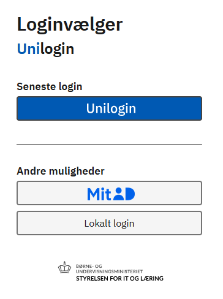

# AulaAPIClient

A wrapper around the Aula school portal, written in typescript. Written against the Danish version (Aula.dk).
En wrapper omkring Aula skoleportalen, skrevet i TypeScript. Skrevet til den danske version (Aula.dk).

The code itself is non-Danish specific, but if there are other non-Danish Aula versions, the login flow or APIs might be different.

## IMPORTANT NOTE: Unilogin changes make this project ineffective
--------------------
In August 2025, the Danish IT strategy changed Unilogin so that it is only applicable for students, no longer parents.  This means that the previous reliance on Unilogin for logging in and scraping no longer is viable, at least with parent credentials
https://viden.stil.dk/spaces/OFFSKOLELOGIN/pages/104333383/Roadmap%2Bfor%2BUnilogin

Because Aula doesn't have an actual API and it is difficult/impossible to use typescript to automatically login using MitID, this project is no longer viable.  

It is possible that this could be used to login with Unlogin using the child login credentials, but it's unclear that most of the functionality would work effectively, and this has not yet been tested in any capacity, not to mention that using the child credentials is more unreliable and could cause problems.  Specifically, the child's credentials may not have the rights to see various things that this library expects to query.

A different approach around this will be explored and other testing done, but for the time being, this project will not work and will be persisted as a relic of the way it used to work (and still might, using the child's credentials)
--------------------

Key features:
- Login with Unilogin credentials
- Pull all major data elements, including:
    - Daily Overview
    - Threads and messages (within timeframe)
    - Posts (within timeframe)
    - Get attachments (images, files) on posts, messages, etc
    - Lookup of parents, children, teachers, etc
    - Pull latest galleries (photos, etc)
- Pulls almost 1:1 all data from Aula, allowing for your own filtering of important information
- Does not write to Aula, send messages or similar

See the sample [integration tests](/tests/defaultIntegration.test.ts) for a fuller example of the various methods and usage.

Note: The Aula API is currently on version 21 at the time of this writing and this client is written for that version.  If Aula updates (v22+), it is possible the methods will still work, but the data structures may change. Meaning, it probably would still work fine, but potentially could introduce errors if the data objects change.


## Login

Login to Aula is typically done via MitId or similar.  This API requires login using the UniLogin username/password, which is separate, and more of a username/password access. 



If you do not already have a Unilogin username/password, you must set one up at
https://www.aula.dk/portal/#/login

The username/password you create is used when instantiating the AulaClient.

## Example usage

To use, instantiate the client with your UniLogin username/password. The login process mimics the process followed when you are using the browser, so it follows a set of POSTS and re-directs.  It is written in a way that should be flexible enough to handle if Aula changes the login flow, but no guarantees.

### Aula Session Management

Normally, the set of login redirects/posts takes upwards of 8-15 seconds as it follows the HTTP flow of Unilogin.  The end result of this is a PHP sessionID used by Aula to verify the login.  Therefore, it is possible to shortcut this 8-15 second login process if you already know a valid PHP sessionId. 

There are two optional callback functions to help with caching and persistence of this sessionId, which you might use to store the sessionID in a file, in memory, or a database.  Note that a sessionId will expire if not used within 60(?) minutes.

If an invalid/expired sessionID is supplied, the client will try it anyway, and if it fails, will continue with the normal login process. If no sessionID is supplied, then the normal login process will proceed.  Therefore, if you are instantiating new Aula clients constantly within short periods, you probably want to implement this caching callback functionality.   If you are only doing it periodically, caching the sessionId is probably not necessary. 

### Example code

Here is an example of logging in, getting the last 21 days of Posts, and then getting an image attachment off the first post.

````javascript

    const aulaConfig = new AulaClientConfig();

    aulaConfig.aulaUserName = process.env.AULA_USERNAME!;
    aulaConfig.aulaPassword = process.env.AULA_PASSWORD!;
    
    let aulaClient = new AulaAPIClient(aulaConfig);

    //Optional function to get a valid sessionId, if already known.
    let getKnownAulaSessionId = async (): Promise<string> => {
        //Your logic here to get the sessionId from some file/memory/db cache, if you want
        return "";
    };

    //Optional function to save a valid sessionId, when login finds it.
    let setKnownAulaSessionId = async (aulaSessionId: string): Promise<void> => {
        //Your logic here to save the sessionId to some file/memory/db cache, if you want
    };

    //The get/set functions are optional.  By providing them, you can optionally 
    //shortcut the login process, which is a tedious set of redirects that takes 10+ seconds
    await aulaClient.Login(getKnownAulaSessionId, setKnownAulaSessionId);

    //Or, alternately, use the client without session management:
    //await aulaClient.Login();

    //Get the last 21 days of Posts
    let POSTS_RETRIEVE_PAST_DAYS = 21;
    let posts = await aulaClient.GetPosts(POSTS_RETRIEVE_PAST_DAYS);

    //Get the url of the image attachment for download.  Note: these urls have an expiration, so must be used quickly.
    let firstPost = posts[0];
    if (firstPost.HasImageAttachments()) {
        let imageAttachments = firstPost.GetImageAttachments();
        let urlToImage = imageAttachments[0].GetFullSizeUrl();
        //... Download the image.  URL is an S3 signed URL, so has a built-in time expiration
    }

````
### Aula Client and Methods

There is a sample integration test using Jest: [integration tests](/tests/defaultIntegration.test.ts) which demonstrates various possibilities and can be used as a reference.

When logging into Aula, you may have multiple profiles, multiple children, and multiple institutions (schools, etc).  Aula -and therefore this client- only acts in the context of a given profile/child/institution combination.  So, for example, if you have multiple children, you must switch the active child in the client.  There is no native "all children" or "all institutions" behavior in this client.

````javascript

    await aulaClient.Login();

    //The first/default child will be set automatically at login
    let currentChild = aulaClient.CurrentChild; //Assume this is "Johnny"

    //This will get the calendar events for the currently set child, Johnny
    let events = aulaClient.GetCalendarEvents();

    //Find my other child named Billy
    let allMyChildren = aulaClient.GetMyChildren();
    let foundChild = allMyChildren.filter(child => child.name.indexOf("Billy") > -1)[0];

    //Set the context of the client to Billy
    let foundChildId = foundChild.id;
    aulaClient.SetMyCurrentChild(foundChildId);

    //This will get the calendar events for the newly set child, Billy
    events = aulaClient.GetCalendarEvents();

    //Or say you wanted events for all children... (might be confusing to unpack, but maybe...)
    events : AulaCalendarEvent[] = [];
    allMyChildren.forEach(child => {
        aulaClient.SetMyCurrentChild(child.id);
        events.push(...aulaClient.GetCalendarEvents(););
    });


````

Note this is separate from a set of methods to find any child, teacher, parent, etc.  For example, to find *any* child:

````javascript

    await aulaClient.Login(getKnownAulaSessionId, setKnownAulaSessionId);

    //The first/default child will be set automatically
    //This is *your* default child, set at login
    let currentChild = aulaClient.CurrentChild; //Assume "Johnny"
    //These are all *your* children
    let allMyChildren = aulaClient.GetMyChildren();

    //Find any child named Lars (scoped to your institution and profile access)
    //Results would also include your own if there's a match, but it's any child in the institution
    let otherChildren = aulaClient.FindAnyChildren("Lars"); 

    //Write out these children
    otherChildren.forEach(child => {
        console.log(child.name);
        let parent = child.GetParents()[0]; //Parent or such
        console.log(parent.firstName);
    });

````


